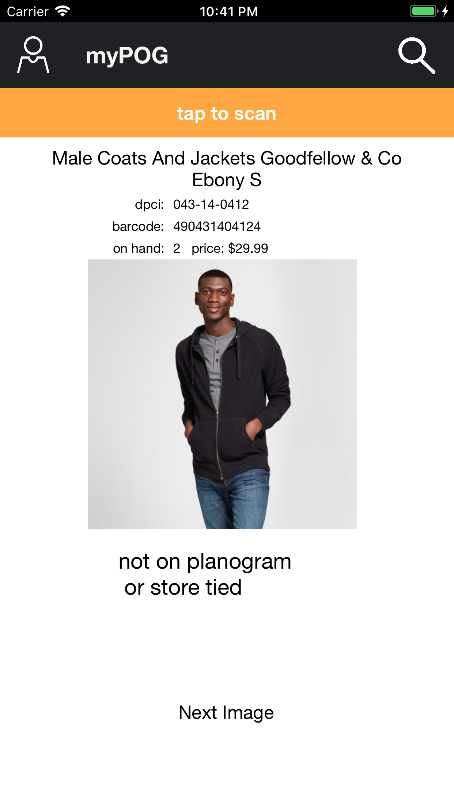
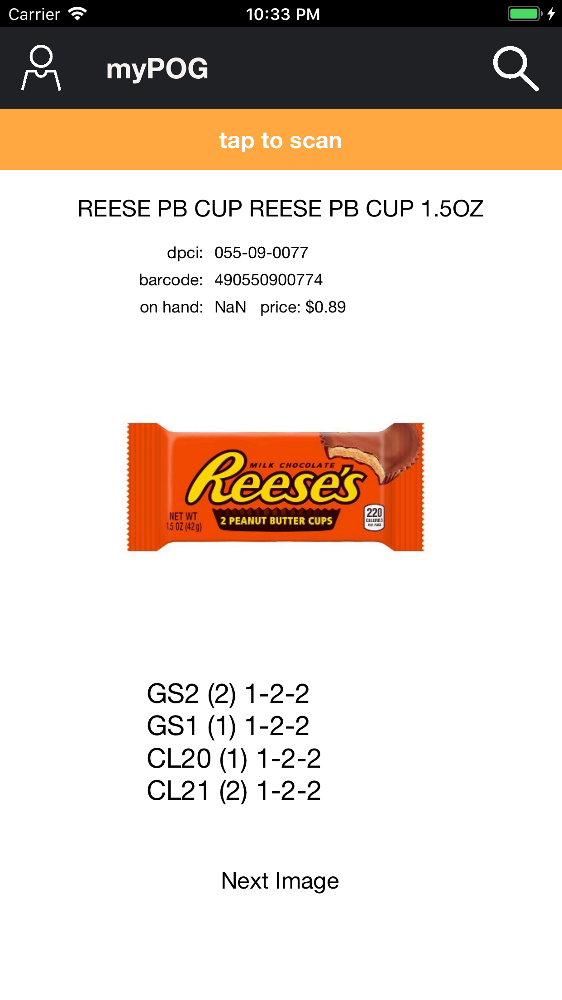

# myPOG
An iOS (10 + 11) app to improve team member efficency.

### Features
* Item Planogram Info
    * 
* Not On Planogram Item Info
    * 
* Multi Locations
    * 
    
Written purely in C# running with Xamarin.iOS
###### External Libraries:
* ZXing.Net.Mobile (Barcode Scanner)
* RestSharp (REST Requests and JSON Deserialization)
* Target Developer APIs
